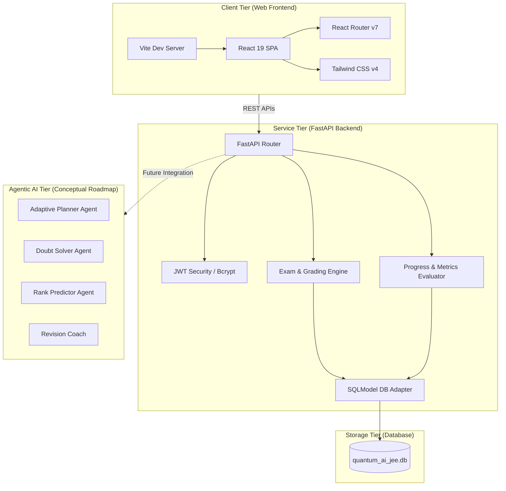

# Quantum AI IIT JEE Mock Tests (VALLURI™)

VALLURI™ is a next-generation, agentic AI-powered mock testing and personalized coaching platform designed specifically for IIT-JEE (Mains & Advanced) aspirants. The system combines robust pedagogy with a multi-agent system that autonomously plans study sessions, resolves student doubts, grades exams, tracks real-time progress, and forecasts Rank/All India Rank (AIR) bands.

This repository hosts a multi-tier codebase containing a fully functional **FastAPI backend**, an elegant **React 19 + TypeScript web application**, and the blueprint architecture for specialized AI agents, mobile/desktop applications, SDKs, and cloud deployment pipelines.

---

## 🏗️ Project Architecture



---

## 📂 Repository Structure

The project is structured logically to separate functional implementations from conceptual blueprints:

```bash
├── agentic_ai/           # Blueprints for autonomous agents (Doubt Solver, Adaptive Planner, Revision Coach)
├── ai_models/            # Machine learning & prediction model architectures (adaptive learning, recommendations)
├── analytics/            # Telemetry dashboards, reports, and visualization definitions
├── backend/              # Core RESTful API implementation
│   ├── authentication/   # JWT creation, validation, and password security utilities
│   ├── models/           # DB entities (User, Question, ExamAttempt) and schemas via SQLModel
│   ├── routes/           # Endpoint routers (Auth, Exams, Progress, Student, Admin)
│   ├── db.py             # SQLite engine setup & table creation logic
│   ├── main.py           # FastAPI entrypoint, middleware, and startup handlers
│   ├── storage.py        # Database operations (CRUD) for users, exams, and questions
│   └── requirements.txt  # Python package dependencies
├── cloud/                # Cloud deployments, dockerization scripts, and GPU infrastructure setup
├── desktop_apps/         # Electron applications wrappers, builders, and EXE installers
├── documentation/        # Technical, architecture, and API documentation
├── frontend/             # Single Page Application
│   └── web/              # React 19 + TypeScript + Vite + Tailwind CSS v4 source code
├── mobile_app/           # Cross-platform mobile project skeletons (Flutter) and build outputs
├── question_bank/        # Structured database of questions organized by subject and topic
├── sdk/                  # Client SDK libraries (Java, Python, Node.js)
├── security/             # Custom JWT configurations, firewalls, and encryption standards
└── tests/                # Unit tests, integration tests, and AI model evaluation suites
```

---

## ⚡ Key Features

*   **Mock Test Engine**: Timed practice exams featuring multiple choice formats, active ticking countdowns, and immediate feedback (explanations & grading details).
*   **Rank Predictor**: Adaptive estimator utilizing historical mock test averages, target exams, category specs, and custom difficulty settings.
*   **Authentication & Auth**: Safe user sign-up and login utilizing modern token storage standards, secure password encryption (Bcrypt), and authorization middleware (JWT tokens).
*   **Progress Dashboard**: Student dashboard mapping overall courses progress, study streak statistics, and subject accuracy charts.
*   **Admin Panel & Question Seeder**: Administrative routes to create, view, modify, and delete questions. Automatic DB seeding with physics, chemistry, and mathematics questions upon backend startup.

---

## ⚙️ Environment Configuration (`.env`)

The backend relies on the following environment variables. Create a `.env` file in the `backend/` directory to configure these variables:

| Variable | Default Value | Description |
| :--- | :--- | :--- |
| `SECRET_KEY` | *(Required)* | Secret key used to sign and encrypt JWT access tokens. |
| `ALGORITHM` | `HS256` | The encryption algorithm used to sign the tokens. |
| `ACCESS_TOKEN_EXPIRE_MINUTES` | `60` | Duration (in minutes) for which a generated JWT is valid. |
| `DATABASE_URL` | `sqlite:///./quantum_ai_jee.db` | Connection string for database. Default points to local SQLite file. |
| `ALLOWED_ORIGINS` | `http://localhost:3000,http://127.0.0.1:3000,http://localhost:5173,http://127.0.0.1:5173` | Allowed CORS origins split by commas. |

---

## 🗄️ Database Schema Specification

The SQLModel ORM auto-generates the database tables based on the following structural models:

### 1. `User` Model
Represents students and admin users.
*   `id` (str, Primary Key): Unique UUID.
*   `name` (str): Full name of the user.
*   `email` (str, Unique, Indexed): Email address (used as login identifier).
*   `hashed_password` (str): Safe hashed password string.
*   `class_level` (str): Level of class, e.g. "11", "12", "Dropper".
*   `target_exam` (str): Target target, e.g. "JEE Mains", "JEE Advanced".
*   `role` (str, default="student"): Authorization roles (e.g. `student` or `admin`).
*   `is_active` (bool, default=True): Active status flag.
*   `is_verified` (bool, default=False): Verification status flag.
*   `selected_subject` (str, Nullable): Currently selected subject filter.
*   `selected_topic` (str, Nullable): Currently selected topic filter.
*   `created_at` (datetime): Timestamp of sign-up.

### 2. `Question` Model
Represents a mock test question.
*   `id` (str, Primary Key): Unique UUID.
*   `exam_type` (str, default="jee_mains"): Exam context (e.g. "jee_mains", "jee_advanced").
*   `subject` (str): Subject classification ("Physics", "Chemistry", "Mathematics").
*   `topic` (str): Topic classification (e.g. "Kinematics", "Chemical Bonding", "Algebra").
*   `question_text` (str): The markdown or plain-text representation of the question.
*   `options` (JSON Array): Array of strings containing choice answers.
*   `correct_option` (str): The exact correct answer string matching one of the options.
*   `explanation` (str, Nullable): Comprehensive explanation of the solution.
*   `created_at` (datetime): Question creation timestamp.

### 3. `ExamAttempt` Model
Tracks student mock test attempts and performance metrics.
*   `id` (str, Primary Key): Unique UUID.
*   `user_id` (str, Foreign Key `user.id`): ID of the student.
*   `subject` (str): Evaluated subject.
*   `topic` (str): Evaluated topic.
*   `total_questions` (int): Total questions count in this session.
*   `correct_answers` (int): Correctly answered questions count.
*   `score` (float): Percentile score (0.0 to 100.0).
*   `duration_seconds` (int): Total seconds taken to complete mock exam.
*   `details` (JSON Array): List of answer details containing:
    ```json
    {
      "question_id": "uuid",
      "selected_option": "string",
      "correct_option": "string",
      "is_correct": true,
      "explanation": "string"
    }
    ```
*   `created_at` (datetime): Completion timestamp.

---

## 📡 API Endpoints Reference

All routes are prefixed with `/api`. Protected routes require a valid HTTP Bearer Token (`Authorization: Bearer <JWT>`).

### 🔑 Authentication (`/api/auth`)
*   `POST /signup`: Register a new student.
    *   **Body**: `UserSignup` schema (`name`, `email`, `password`, `class_level`, `target_exam`).
    *   **Response**: `201 Created` with signed up user metadata.
*   `POST /login`: Generate authentication token.
    *   **Body**: `UserLogin` schema (`email`, `password`).
    *   **Response**: `200 OK` with `access_token`, `token_type`, and expiry time.
*   `GET /me` *(Protected)*: Get details of the currently authenticated user.
    *   **Response**: `200 OK` with `UserPublic` payload.

### 🎓 Student Context (`/api/student`)
*   `POST /selection` *(Protected)*: Save current subject and topic filters.
    *   **Body**: `StudentSelection` schema (`subject`, `topic`).
*   `GET /selection` *(Protected)*: Retrieve active filters for the logged-in student.

### 📝 Mock Exams (`/api/exams`)
*   `GET /questions` *(Protected)*: Fetch a randomized set of practice questions.
    *   **Query Params**: `subject`, `topic` (optional filters) & `limit` (default: 10).
*   `POST /submit` *(Protected)*: Grade an exam submission and persist the results.
    *   **Body**: `ExamSubmission` schema (`subject`, `topic`, `answers: List[{question_id, selected_option}]`, `duration_seconds`).
    *   **Response**: `ExamResult` detailing total questions, correct answers, total percentage, and detailed solution explanations.
*   `GET /history` *(Protected)*: Fetch history of all exam attempts for the active student.
*   `GET /leaderboard` *(Protected)*: Fetch top test scores.
    *   **Query Params**: `subject`, `topic`, `limit` (default: 10).

### 📈 Metrics & Progress (`/api/progress`)
*   `GET /summary` *(Protected)*: Fetch aggregated progress statistics.
    *   **Response**: `ProgressSummary` (`total_attempts`, `average_score`, `best_score`, list of `recent_attempts`, dictionary of `subject_accuracy`, and list of `weak_topics` sorted by lowest score).

### 🛡️ Admin Utilities (`/api/admin`)
*   `POST /questions` *(Admin Only)*: Insert a new mock question into the bank.
*   `GET /questions` *(Admin Only)*: List all questions in chronological order.
*   `PUT /questions/{question_id}` *(Admin Only)*: Edit a specific question's fields.
*   `DELETE /questions/{question_id}` *(Admin Only)*: Delete a question.

---

## 💻 Development & Integration Flow

### Local State Mocking (Frontend Prototype)
The React frontend application currently uses a `localStorage` mocking approach in files like [Login.tsx](file:///E:/eduos/frontend/web/src/pages/Login.tsx) and [MockTest.tsx](file:///E:/eduos/frontend/web/src/pages/MockTest.tsx). This allows UI design and client-side page routing to function standalone without requiring a running backend.

To transition the frontend to integrate directly with the live FastAPI backend:
1.  Replace local storage writes and reads inside actions (e.g. `loginStudent` in `Login.tsx`) with asynchronous `fetch` or `axios` queries targeting the backend port (e.g. `http://localhost:8000/api/auth/login`).
2.  Pass the active JWT token inside HTTP headers (`Authorization: Bearer <token>`) for routes requiring authentication.

### Database Reset & Seeding
If you need to reset the database schema or seed data during development:
1.  Stop the backend process.
2.  Delete the database file:
    ```bash
    rm backend/quantum_ai_jee.db
    ```
3.  Restart the backend server. The backend's startup event listener will auto-generate the database tables and insert sample questions (`Physics/Kinematics`, `Chemistry/Chemical Bonding`, `Mathematics/Algebra`).

---

## ⚡ Getting Started

### Backend Setup

1.  **Navigate to the backend directory**:
    ```bash
    cd backend
    ```

2.  **Create a virtual environment**:
    ```bash
    python -m venv venv
    ```

3.  **Activate the virtual environment**:
    *   **Windows**:
        ```powershell
        .\venv\Scripts\activate
        ```
    *   **macOS/Linux**:
        ```bash
        source venv/bin/activate
        ```

4.  **Install dependencies**:
    ```bash
    pip install -r requirements.txt
    ```

5.  **Set up environment variables**:
    Create a `.env` file from the example:
    ```bash
    cp .env.example .env
    ```
    *(Ensure a secure `SECRET_KEY` is provided)*

6.  **Run the development server**:
    ```bash
    uvicorn main:app --reload
    ```
    The API documentation will be available at [http://127.0.0.1:8000/docs](http://127.0.0.1:8000/docs).

### Frontend Setup

1.  **Navigate to the frontend directory**:
    ```bash
    cd frontend/web
    ```

2.  **Install node packages**:
    ```bash
    npm install
    ```

3.  **Launch the Vite dev server**:
    ```bash
    npm run dev
    ```
    The web application will launch at [http://localhost:5173](http://localhost:5173).

---

## 🗺️ Roadmap & Conceptual Blueprints

The root directories that contain empty templates represent the conceptual scope and future features of **VALLURI™**:

1.  **Agentic AI (`agentic_ai/`)**: Intended for specialized agents communicating asynchronously via messages to orchestrate study schedules, answer student queries, and design individual custom mock papers.
2.  **Mobile Client (`mobile_app/`)**: Built to serve Flutter application targets compiling into native iOS (`.ipa`) and Android (`.apk`) apps.
3.  **Desktop Client (`desktop_apps/`)**: For delivering packaged offline-ready desktop examination clients built using Electron.
4.  **SDKs (`sdk/`)**: Language-specific API wrappers to integrate question banks and grading algorithms into other institutional applications.

---

## 📝 License

This project is proprietary. All rights reserved.
